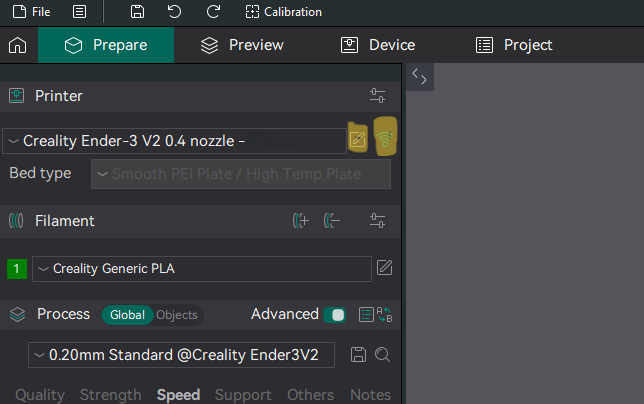
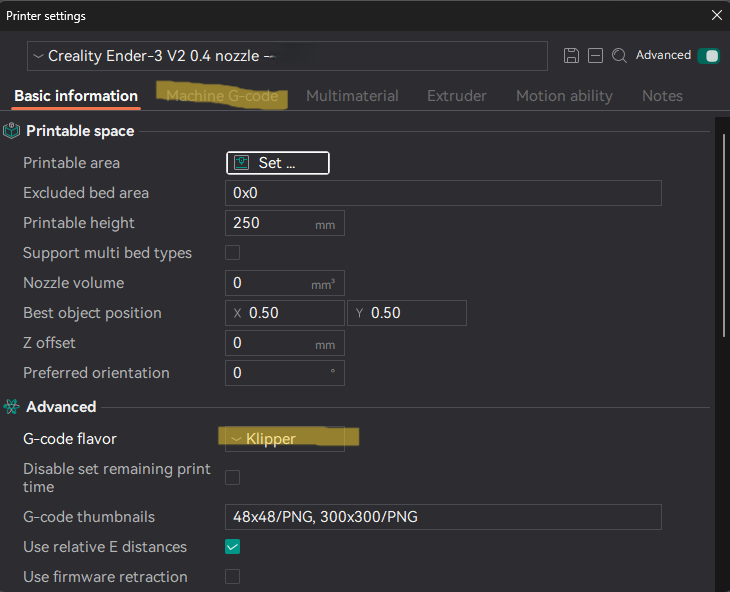
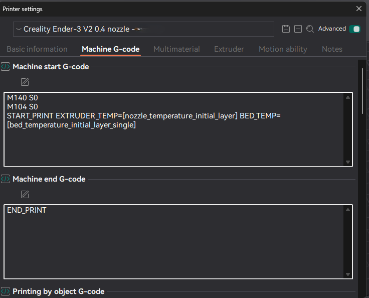
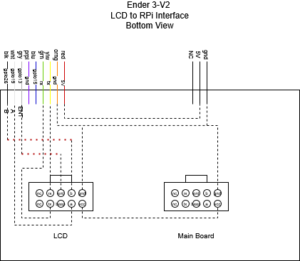

# Creality Ender 3V2 Klipper
A guide on setting up Klipper on the Ender 3V2.

I relied heavily on [this guide](https://www.obico.io/blog/install-klipper-ender-3/) for the initial setup and installation.

I used the macros from [this repo](https://github.com/LeeOtts/Ender3v2-Klipper-Configs/tree/main). I modified a few of the settings for the Creality 4.2.2 board.

This has configs for the [EZABL](https://www.th3dstudio.com/product/ezabl-ng-auto-bed-leveling-kit-for-unified-2-klipper-marlin-firmware/). The klipper config was [found here](https://tickets.th3dstudio.com/products/article/ezabl-klipper-setup-guide).

------------------------------------

## Using a printer I setup

1. Download and install [OrcaSlicer](https://github.com/SoftFever/OrcaSlicer/releases). At the time of this writing [V2.2.0](https://github.com/SoftFever/OrcaSlicer/releases/tag/v2.2.0) is the latest stable release.
2. Setup the profile for the Ender 3V2.
3. Change the gcode to klipper.
4. Change the starup gcode.
5. Setup network

### Change the gcode to klipper
Click on the  icon to edit the printer settings.



Change the "G-code flavor" to "Klipper"



### Change the startup gcode
Click on the  icon to edit the printer settings.


Select the Machine G-code tab


Add the following for "Machine start G-code":
```
 M117
M140 S0
M104 S0 
START_PRINT EXTRUDER_TEMP=[nozzle_temperature_initial_layer] BED_TEMP=[bed_temperature_initial_layer_single]
```

Add the following to "Machine end G-code":
```
END_PRINT
```
## Calibrate Z Offset

- home all axies
- in the console: ``PROBE_CALIBRATE``
- use controls to calibrate
- ``SAVE_CONFIG``
- ``PROBE_ACCURACY``

## Mainboard Configuration
- [SKR mini E3 v3.0](https://github.com/bigtreetech/BIGTREETECH-SKR-mini-E3/tree/master/hardware/BTT%20SKR%20MINI%20E3%20V3.0)
- [Runs Klipper](https://github.com/bigtreetech/BIGTREETECH-SKR-mini-E3/tree/master/firmware/V3.0/Klipper)

## PID Calibration

In the console:
- ``PID_CALIBRATE HEATER=extruder TARGET=200``
- ``PID_CALIBRATE HEATER=heater_bed TARGET=60``
- ``SAVE_CONFIG``

NOTE: You only need to do this if you replace the thermistor or hotend, OR on first calibration.

## LCD Interface

NOTE: I didn't get this setup. Using the OEM screen requires using the the UART pins on the Raspberry Pi, which are used for comminicating with the main board.

It is possible to use a BTT LCD, however the pins on the mainboard are being used. The SKR Mini E4 does have other UART pins, but I used the TFT pins.

[DWIN_T5UIC1_LCD](https://github.com/bustedlogic/DWIN_T5UIC1_LCD) is a Python class for the Ender 3 V2 LCD runing klipper3d with Moonraker. The interface board used the original cable and uses the power from the mainboard to power the LCD and use and external power supply for the raspberry pi. A single cable runs to the raspberry pi.



## Printed Parts

- [Ender 3/3v2 Cable Chain](https://www.printables.com/model/349525-ender-33v2-cable-chain/comments) (`X_Hotend_Connector.stl` doesn't fit correctly)
- [Solid Ender 3 Cable Chains for all Axes](https://www.thingiverse.com/thing:4316238/files) (only need `X_axis_hotend_connector_20mm_longer.stl`)
- [Case with 4040 Mount for Raspberry Pi Zero REMIX](https://www.thingiverse.com/thing:5239378)
- [Utra-slim Raspberry Pi Zero 2 W case for 2020 profile](https://www.printables.com/model/316538-utra-slim-raspberry-pi-zero-2-w-case-for-2020-prof/)
- [Raspberry Pi Zero 2 W Case](https://www.printables.com/model/361093-raspberry-pi-zero-2-w-case)